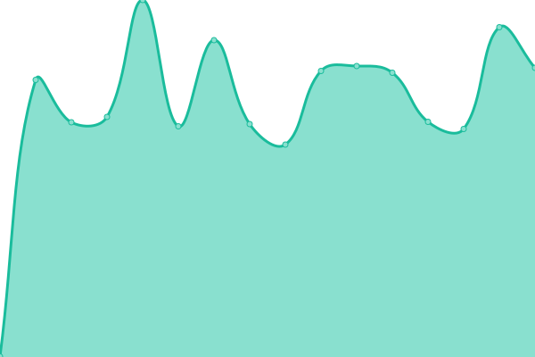
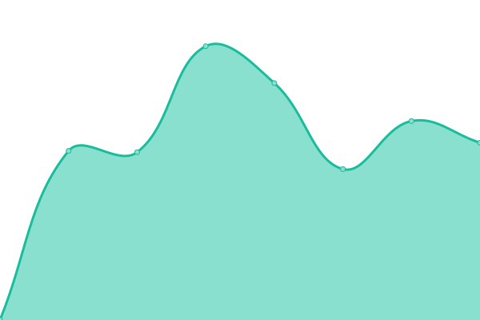
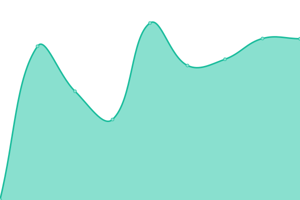
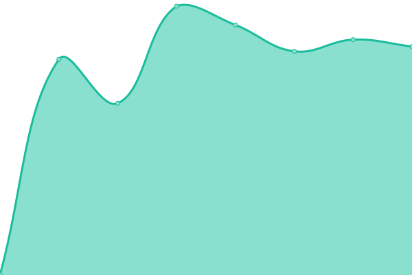
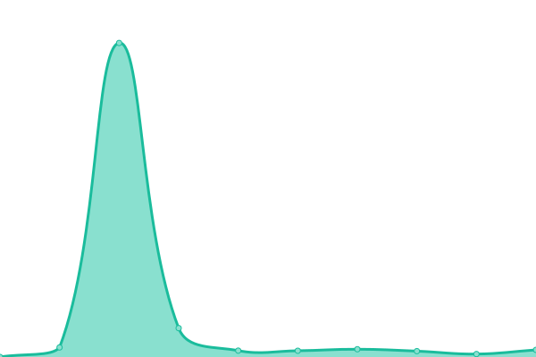
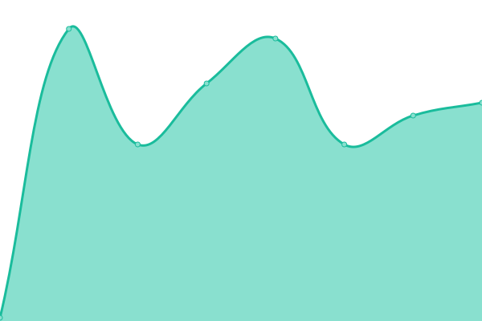

# [📈 Live Status](https://upptime.github.io/upptime): <!--live status--> **🟧 Partial outage**

This repository contains the open-source uptime monitor and status page for [Upptime](https://upptime.js.org), powered by [Upptime](https://github.com/upptime/upptime).

With [Upptime](https://upptime.js.org), you can get your own unlimited and free uptime monitor and status page, powered entirely by a GitHub repository. We use [Issues](https://github.com/upptime/upptime/issues) as incident reports, [Actions](https://github.com/junjanjon/WatchSomeSites/actions) as uptime monitors, and [Pages](https://upptime.github.io/upptime) for the status page.

<!--start: status pages-->
<!-- This summary is generated by Upptime (https://github.com/upptime/upptime) -->
<!-- Do not edit this manually, your changes will be overwritten -->
<!-- prettier-ignore -->
| URL | Status | History | Response Time | Uptime |
| --- | ------ | ------- | ------------- | ------ |
|  [kawaki](https://www.pegasusknight.com) | 🟩 Up | [kawaki.yml](https://github.com/junjanjon/WatchSomeSites/commits/HEAD/history/kawaki.yml) | 

 655ms
     
 | 

<a href="https://junjanjon.github.io/WatchSomeSites/history/kawaki">100.00%</a>
    

|  [chatwork-kcw](https://kcw.kddi.ne.jp/) | 🟩 Up | [chatwork-kcw.yml](https://github.com/junjanjon/WatchSomeSites/commits/HEAD/history/chatwork-kcw.yml) | 

 1314ms
     
 | 

<a href="https://junjanjon.github.io/WatchSomeSites/history/chatwork-kcw">100.00%</a>
    

|  [AROW](https://arow.world/ja/) | 🟩 Up | [arow.yml](https://github.com/junjanjon/WatchSomeSites/commits/HEAD/history/arow.yml) | 

 651ms
     
 | 

<a href="https://junjanjon.github.io/WatchSomeSites/history/arow">100.00%</a>
    

|  [TID](https://tech.drecom.co.jp) | 🟩 Up | [tid.yml](https://github.com/junjanjon/WatchSomeSites/commits/HEAD/history/tid.yml) | 

 959ms
     
 | 

<a href="https://junjanjon.github.io/WatchSomeSites/history/tid">100.00%</a>
    

|  [my-wiki-js](https://j-wiki.herokuapp.com/) | 🟥 Down | [my-wiki-js.yml](https://github.com/junjanjon/WatchSomeSites/commits/HEAD/history/my-wiki-js.yml) | 

 1969ms
     
 | 

<a href="https://junjanjon.github.io/WatchSomeSites/history/my-wiki-js">99.70%</a>
    

|  [Test for HEAD](https://www.google.com) | 🟩 Up | [test-for-head.yml](https://github.com/junjanjon/WatchSomeSites/commits/HEAD/history/test-for-head.yml) | 

 70ms
     
 | 

<a href="https://junjanjon.github.io/WatchSomeSites/history/test-for-head">100.00%</a>
    

<!--end: status pages-->

[**Visit our status website →**](https://upptime.github.io/upptime)

## 📄 License

- Powered by: [Upptime](https://github.com/upptime/upptime)
- Code: [MIT](./LICENSE) © [Upptime](https://upptime.js.org)
- Data in the `./history` directory: [Open Database License](https://opendatacommons.org/licenses/odbl/1-0/)
